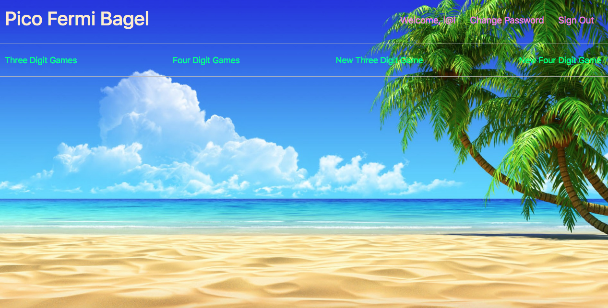

## Pico Fermi

My app is a game called "pico fermi bagel". A secret number is generated upon
creating a game, of which the user tries to guess the number, a three or four
digit number. Through use of feedback in the form of "pico", "fermi", and "bagel",
the user narrows down the number until they eventually guess it, based on information
from the previous guesses. Pico means a digit is a the correct number, however
the number is in the wrong digits place. Fermi means there is a correct digit
in the correct place. Bagel means there are no numbers guessed in the correct
number. My app allows a user to create a game with their own words for pico,
fermi, and bagel for either a three digit or four digit number. The app then
allows you to view any and all other games that have been posted, seperated by
three digit game lists and four digit game lists. However, a user may only edit or delete
their own created games, that includes renaming the pico fermi bagel names. Enjoy!

Link to back end github repo: https://github.com/hansenmason/rails-capstone
Link to deployed front end:
Link to deployed back end:

## Technologies used

For this project I used ruby on rails for api interfacing and react for front end.
I used CSS for styling.

## Problems

One problem I was trying to solve, but was unable to fix, involved generating
a new number as an edit to a game rather than having to start a new one to
generate a new number through the create CRUD. The way I planned to implement
it was having to put the game logic and randomnumber into the update file,
but I thought this would be too much, and figured there must have been a way
to make a form for it but was unable to do so. I hope to solve this, as well as
add more digit types into the mix.

## Screenshot

## Planningg

My planning was the get the back end in order, and then go to the game logic,
and finally add the styling. I had difficulty finding out what to save to the user,
and what to be able to update, and destroy. I ended up allowing a user to
save their words for pico fermi and bagel as their own, which then get used
in the in-game feedback. This is able to be updated to the game, as well as a user
can delete their game. I also thought about saving the number locally, but I
ended up adding it to the user on the background, as I found this more efficient.
I then moved onto the front end, and built the game logic. I then moved on the
CRUD of the games. I then added a four digit game to the back end, and then
established it in the front end. Once this was completed, I worked on the colors
for the site, and the other css. Any problems that I arose I used console.log
for and worked based on the feedback. I did a lot of referring to google as well,
especially with back end, and css. I also asked peers for help with css.

## Installation

1. Fork and Clone this repository into desired folder.
1. Move into the new project and `git init`.
1. Open in atom or equivalent.
1. Empty [`README.md`](README.md) and fill with your own content.
1. Replace `https://hansenmason.github.io/capstone` in `package.json` with your
   projects name.
1. Replace the `"homepage"` field in `package.json` with your (public) Github
   account name and repository name.
1. Install dependencies with `npm install`.
1. `git add` and `git commit` your changes.
1. Run the development server with `npm start`.

## User Stories

-   As a user, I want to be able to sign up using an email address and password
-   As a user, I want to be able to sign in, and also change my password
-   As a user, I want to be able to create games when signed in
-   As a user, I want to be able to play the game that I create
-   As a user, I want to be able to play the game that others have created
-   As a user, I want to be able to edit what I call each feedback event
-   As a user, I want to be able to delete only my games, and not others
-   As a user, I want to be able to update only my games, and not others
-   As a user, I want to it to show each feedback guess so I can use that as info
-   As a user, I want it to be clear when the game is over

## Link to wireframe

https://imgur.com/4Cxxb5H
